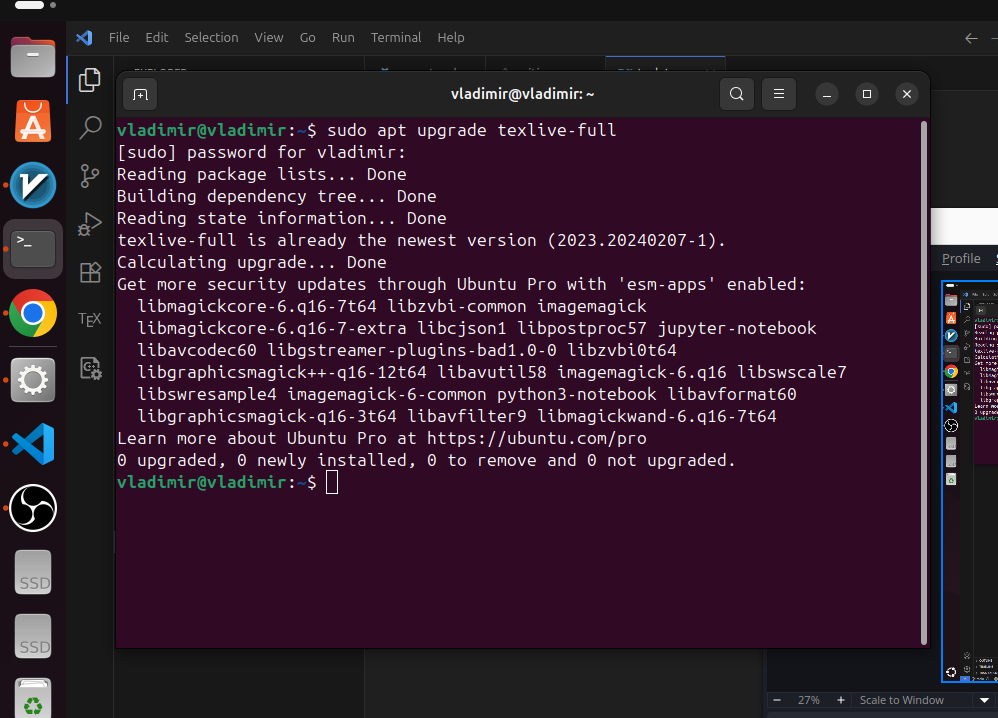

---
## Front matter
lang: ru-RU
title: Лабораторная работа №1
subtitle: Подготовка рабочей среды
author:
  - Кубасов В.Ю., ст.б. 1132249516
date: 21 сентября 2025

## i18n babel
babel-lang: russian
babel-otherlangs: english

## Formatting pdf
toc: false
toc-title: Содержание
slide_level: 2
aspectratio: 169
section-titles: true
theme: metropolis
header-includes:
 - \metroset{progressbar=frametitle,sectionpage=progressbar,numbering=fraction}

## Fonts
mainfont: IBM Plex Serif
romanfont: IBM Plex Serif
sansfont: IBM Plex Sans
monofont: IBM Plex Mono
mathfont: STIX Two Math
mainfontoptions: Ligatures=Common,Ligatures=TeX,Scale=0.94
romanfontoptions: Ligatures=Common,Ligatures=TeX,Scale=0.94
sansfontoptions: Ligatures=Common,Ligatures=TeX,Scale=MatchLowercase,Scale=0.94
monofontoptions: Scale=MatchLowercase,Scale=0.94,FakeStretch=0.9
mathfontoptions:
---

# Вводная часть

Для работы с Latex крайне необходимо установить ПО Latex

## Цели и задачи
### Цель работы:   

- Установить пакеты Latex... на рабочую станцию

### Задачи работы:

- Скачать любым из доступных способов необходимые пакеты

# Теоретическое введение

В этом курсе объясняются основы LaTeX и принципы его работы в отличие от
распространённых текстовых процессоров, таких как Microsoft Word или LibreOffice Writer.
В отличие от распространённых текстовых процессоров, таких как Microsoft Word или LibreOffice Writer,
LaTeX обычно не поддерживает WYSIWYG («Что видишь, то и получаешь»).

# Реализация

## Установка через пакетный менеджер apt

## Проверка движка .tex

## Проверка движка .tex

# Вывод

- Подготовили рабочее окружение для работы с Latex-ом

