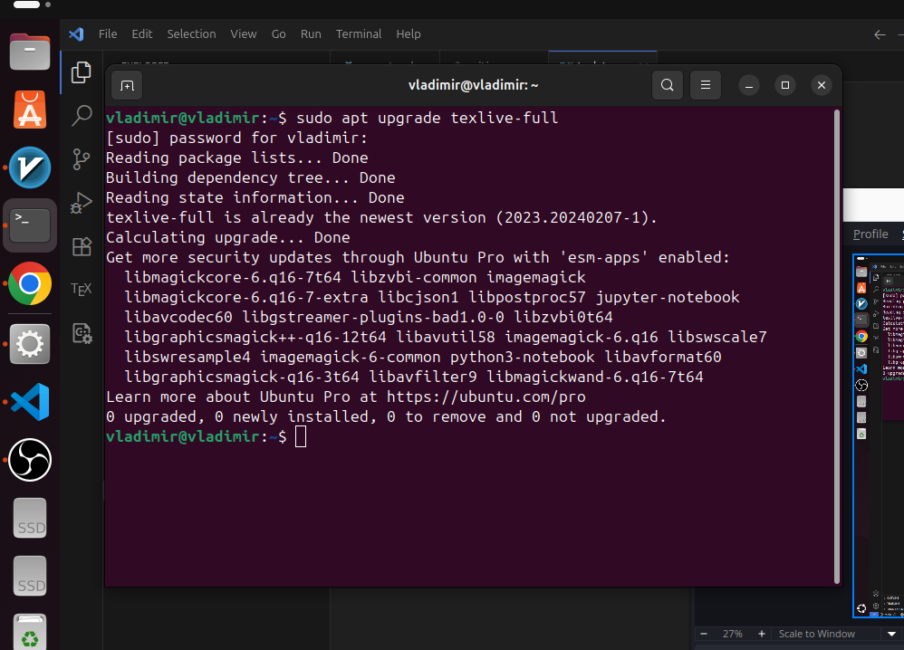

---
## Front matter
title: "Лабораторная работа №1"
subtitle: "Подготовка рабочей среды"
author: "Кубасов В.Ю., ст.б. 1132249516"

## Generic otions
lang: ru-RU
toc-title: "Содержание"

## Bibliography
bibliography: bib/cite.bib
csl: pandoc/csl/gost-r-7-0-5-2008-numeric.csl

## Pdf output format
toc: true # Table of contents
toc-depth: 2
lof: false # List of figures
lot: false # List of tables
fontsize: 12pt
linestretch: 1.5
papersize: a4
documentclass: scrreprt
## I18n polyglossia
polyglossia-lang:
  name: russian
  options:
	- spelling=modern
	- babelshorthands=true
polyglossia-otherlangs:
  name: english
## I18n babel
babel-lang: russian
babel-otherlangs: english
## Fonts
mainfont: IBM Plex Serif
romanfont: IBM Plex Serif
sansfont: IBM Plex Sans
monofont: IBM Plex Mono
mathfont: STIX Two Math
mainfontoptions: Ligatures=Common,Ligatures=TeX,Scale=0.94
romanfontoptions: Ligatures=Common,Ligatures=TeX,Scale=0.94
sansfontoptions: Ligatures=Common,Ligatures=TeX,Scale=MatchLowercase,Scale=0.94
monofontoptions: Scale=MatchLowercase,Scale=0.94,FakeStretch=0.9
mathfontoptions:
## Biblatex
biblatex: true
biblio-style: "gost-numeric"
biblatexoptions:
  - parentracker=true
  - backend=biber
  - hyperref=auto
  - language=auto
  - autolang=other*
  - citestyle=gost-numeric
## Pandoc-crossref LaTeX customization
figureTitle: "Рис."
tableTitle: "Таблица"
listingTitle: "Листинг"
## Misc options
indent: true
header-includes:
  - \usepackage{indentfirst}
  - \usepackage{float} # keep figures where there are in the text
  - \floatplacement{figure}{H} # keep figures where there are in the text
---

# Цель работы

- Установить пакеты Latex... на рабочую станцию

# Задание

- Скачать любым из доступных способов необходимые пакеты

# Теоретическое введение

В этом курсе объясняются основы LaTeX и принципы его работы в отличие от
распространённых текстовых процессоров, таких как Microsoft Word или LibreOffice Writer.
В отличие от распространённых текстовых процессоров, таких как Microsoft Word или LibreOffice Writer,
LaTeX обычно не поддерживает WYSIWYG («Что видишь, то и получаешь»).
В LaTeX берётся простой текст и дополняется разметкой. Эта разметка сообщает LaTeX
логическое значение определённых элементов текста, подобно тому, как это делает HTML.
Возьмём, к примеру, элемент, обозначающий новый раздел в HTML-документе.
В LaTeX также есть команда для этого; в данном случае используется команда \section.
Рабочий процесс LaTeX
Поскольку файлы LaTeX — это не сам документ, а скорее инструкции о том,
какой должна быть каждая часть документа, обычно вы не передаёте другим людям свой
файл LaTeX. Вместо этого, после написания исходного текста LaTeX, вы запускаете LaTeX для файла
(обычно с помощью программы pdflatex) для создания PDF-файла.
Несколько запусков LaTeX
Для простых файлов вам достаточно один раз набрать файл, чтобы получить готовый PDF-файл.
Но как только вы начнете добавлять более сложные элементы, такие как перекрестные ссылки, цитаты,
рисунки и оглавления, вам может потребоваться запустить LaTeX несколько раз.
LaTeX — это не одна программа. Позже в курсе мы рассмотрим другие программы и объясним, почему вы можете их использовать.
Форматы и движки
В большинстве наших примеров мы используем не программу latex, а
pdflatex. Это одна из целого семейства родственных программ, каждая из которых является
«потомками» latex.
LaTeX построен на системе TeX. Мы называем LaTeX «форматом»: набором
макросов (инструкций и команд), которые понимает TeX. Запуская pdflatex, вы фактически запускаете программу под названием «pdfTeX» с предустановленным «форматом LaTeX». Обычно мы называем pdfTeX движком: программой, которая понимает
инструкции TeX.
Сегодня широко используются три движка:
• pdfTeX
• XeTeX
• LuaTeX
Это специализированные движки для вертикального набора. LuaTeX также может многое из этого,
но на данный момент upTeX, в частности, остаётся самой популярной системой для
японского языка.

# Выполнение лабораторной работы

Процесс установки занимает некоторое время, ввиду чего было произведено обновление уже существующего пакета

После тестового файла транслируем его в пдф:

# Выводы

- Установили texlive-full пакет для работы с Latex

# Список литературы{.unnumbered}

::: {#refs}
:::
