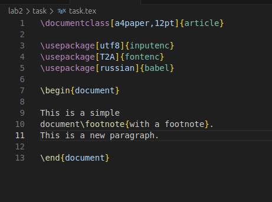

---
## Front matter
lang: ru-RU
title: Лабораторная работа №2
subtitle: Компилирующийся пример документа Latex
author:
  - Кубасов В.Ю., ст.б. 1132249516
date: 21 сентября 2025

## i18n babel
babel-lang: russian
babel-otherlangs: english

## Formatting pdf
toc: false
toc-title: Содержание
slide_level: 2
aspectratio: 169
section-titles: true
theme: metropolis
header-includes:
 - \metroset{progressbar=frametitle,sectionpage=progressbar,numbering=fraction}

## Fonts
mainfont: IBM Plex Serif
romanfont: IBM Plex Serif
sansfont: IBM Plex Sans
monofont: IBM Plex Mono
mathfont: STIX Two Math
mainfontoptions: Ligatures=Common,Ligatures=TeX,Scale=0.94
romanfontoptions: Ligatures=Common,Ligatures=TeX,Scale=0.94
sansfontoptions: Ligatures=Common,Ligatures=TeX,Scale=MatchLowercase,Scale=0.94
monofontoptions: Scale=MatchLowercase,Scale=0.94,FakeStretch=0.9
mathfontoptions:
---

# Вводная часть

- Для того, чтобы научиться создавать полноценные коммерчески-важные документы на Latex, требуется создать небольшой рабочий пример

## Цели и задачи
### Цель работы:   

- Создать документ Latex, используя latex-аттрибуты

### Задачи работы:

- Использовать отступы
- Использовать разделы, подразделы и списки как самое частоиспользуемое

# Теоретическое введение

The first document shows the basics. LaTeX documents are a mixture of text and
commands. The commands start with a backslash and sometimes have arguments
in curly braces (or sometimes optional arguments in square brackets). Then you
get an output PDF by telling LaTeX to typeset your file.

# Реализация

## Шаблон документа из примера в курсе

## Математические записи

## Параграф и жесткие пробелы

## Нумерованный список

## Разделы и подразделы

# Выводы

