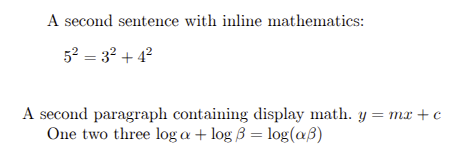
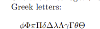
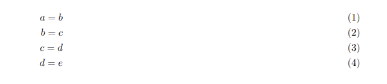

---
## Front matter
lang: ru-RU
title: Лабораторная работа №3
subtitle: Mathematical equations
author:
  - Кубасов В.Ю., ст.б. 1132249516
date: 11 октября 2025

## i18n babel
babel-lang: russian
babel-otherlangs: english

## Formatting pdf
toc: false
toc-title: Содержание
slide_level: 2
aspectratio: 169
section-titles: true
theme: metropolis
header-includes:
 - \metroset{progressbar=frametitle,sectionpage=progressbar,numbering=fraction}

## Fonts
mainfont: IBM Plex Serif
romanfont: IBM Plex Serif
sansfont: IBM Plex Sans
monofont: IBM Plex Mono
mathfont: STIX Two Math
mainfontoptions: Ligatures=Common,Ligatures=TeX,Scale=0.94
romanfontoptions: Ligatures=Common,Ligatures=TeX,Scale=0.94
sansfontoptions: Ligatures=Common,Ligatures=TeX,Scale=MatchLowercase,Scale=0.94
monofontoptions: Scale=MatchLowercase,Scale=0.94,FakeStretch=0.9
mathfontoptions:
---


# Вводная часть
## Цели и задачи
### Цель работы:

- Изучить язык математических формул latex

### Задачаи работы:

- Try out some basic math mode work: take the examples and switch between inline
and display math modes. Can you see what effect this has.
- Try adding other Greek letters, both lower- and uppercase. You should be able to
guess the names.
- Experiment with the font changing commands: what happens when you  try to nest
them?
- Displayed math is centered by default; try adding the document class option
\[fleqn\] (flush left equation) option to some of the above examples to see a different layout. 
Similarly equation numbers are usually on the right. Experiment with
adding the \[leqno\] (left equation numbers) document class option.

# Теоретическое введение


- Для режима отображения математических формул можно использовать те же команды, что и для встроенных функций.
Режим отображения математических формул по умолчанию центрирован и предназначен для больших формул, являющихся частью абзаца. Обратите внимание, что среды отображения математических формул не допускают, чтобы абзац заканчивался внутри математических формул, поэтому в исходном тексте может не быть пустых строк.
- Абзац всегда должен начинаться до отображения, поэтому не оставляйте пустую строку перед средой отображения математических формул. Если вам нужно несколько строк математических формул,
не используйте последовательные среды отображения математических формул (это приводит к неравномерному
расстоянию); используйте одну из многострочных сред отображения, например, align из
пакета amsmath, описанного далее.
- Математическая нотация очень богата, и это означает, что инструменты, встроенные в ядро ​​LaTeX,
не могут охватить всё. Пакет amsmath расширяет базовую поддержку,
чтобы охватить гораздо больше идей. Руководство пользователя amsmath содержит гораздо больше примеров,
чем мы можем показать в этом уроке.

# Реализация

## Заголовки

```tex
\documentclass{article}

\usepackage[utf8]{inputenc}  
\usepackage[T2A]{fontenc}     
\usepackage[russian]{babel} 
\usepackage[fleqn]{amsmath}
```
## Отображение
```tex
\begin{document}
A second sentence with inline mathematics:
\[
5^{2}=3^{2}+4^{2}
\]\\
A second paragraph containing display math.
$y = mx + c$

One two three
$\log \alpha + \log \beta = \log(\alpha\beta)$

```

## Отображение



## Греческие литеры

```tex
Greek letters: 
\[
\phi \Phi \pi \Pi \delta \Delta \lambda \Lambda \gamma \Gamma \theta \Theta
\]
```

## Греческие литерами



## Выравнивание

```tex
Nested fonts:

$\mathit{abracadabra \mathbf{this is bold italic}}$

\begin{align}
   a=b\\
   b=c\\
   c=d\\
   d=e
\end{align}

\end{document}
```

## Выравнивание



# Вывод


