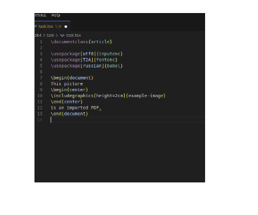
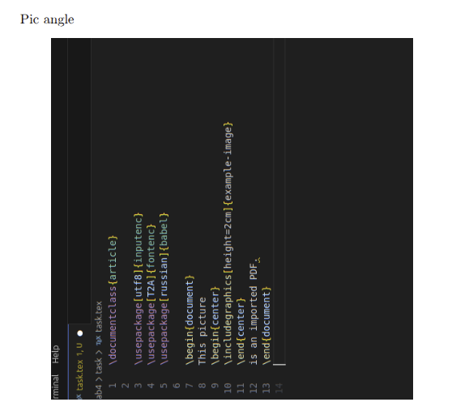

---
## Front matter
lang: ru-RU
title: Лабораторная работа №4
subtitle: "Images, floats, hyperrefs"
author:
  - Кубасов В.Ю., ст.б. 1132249516
date: 12 октября 2025

## i18n babel
babel-lang: russian
babel-otherlangs: english

## Formatting pdf
toc: false
toc-title: Содержание
slide_level: 2
aspectratio: 169
section-titles: true
theme: metropolis
header-includes:
 - \metroset{progressbar=frametitle,sectionpage=progressbar,numbering=fraction}

## Fonts
mainfont: IBM Plex Serif
romanfont: IBM Plex Serif
sansfont: IBM Plex Sans
monofont: IBM Plex Mono
mathfont: STIX Two Math
mainfontoptions: Ligatures=Common,Ligatures=TeX,Scale=0.94
romanfontoptions: Ligatures=Common,Ligatures=TeX,Scale=0.94
sansfontoptions: Ligatures=Common,Ligatures=TeX,Scale=MatchLowercase,Scale=0.94
monofontoptions: Scale=MatchLowercase,Scale=0.94,FakeStretch=0.9
mathfontoptions:
---


# Вводная часть
## Цели и задачи
### Цель работы:

- Научиться выравниванию
- Овладеть навыками картинок

### Задачи работы:
- Попробуйте включить созданное вами изображение, заменив «стандартные», которые мы
использовали в демонстрации.
- Изучите возможности клавиш высоты, ширины, угла и масштаба.
- Используйте клавишу ширины, чтобы задать размер графического элемента относительно ширины текста, а
другого графического элемента относительно ширины строки. Попробуйте, как они ведут себя с опцией «два столбца» и без неё.
### Задачи работы:
- Используйте Lipsum для создания достаточно длинной демонстрации, а затем попробуйте разместить
плавающие элементы с помощью различных спецификаторов положения. Как взаимодействуют
различные спецификаторы?
- Попробуйте добавить новые пронумерованные части (разделы, подразделы, нумерованные списки)
в тестовый документ и выяснить, сколько запусков потребуется для работы
команд с метками.
### Задачи работы:
- Добавьте несколько плавающих элементов и посмотрите, что произойдёт, если поставить метку перед
заголовком, а не после; можете ли вы предсказать результат?
- Что произойдёт, если поставить метку для уравнения после end?

# Теоретическое введение

Чтобы добавить графику извне LaTeX, используйте пакет graphicx, который добавляет
команду includegraphics в LaTeX. Вы можете включать файлы EPS, PNG, JPG и PDF. Если у вас несколько версий
графики, вы можете написать, например, example-image.png. (Пакет graphicx
попытается угадать расширение, если вы его не укажете.)
Вы заметите, что мы использовали здесь новое окружение, center, чтобы разместить изображение
горизонтально по центру страницы. Чуть позже мы подробнее поговорим о интервалах и
позиционировании.

# Реализация

## Изображения 

```tex
\begin{center}
\includegraphics[width = 0.5\linewidth]{image.png}
\end{center}
```

## Изображения 



## Изображения 

```tex

\begin{center}
\includegraphics[width = 0.5\linewidth]{image.png}
\end{center}

\begin{center}
\includegraphics[scale = 0.2]{image.png}
\end{center}

\begin{center}
\includegraphics[angle = 90, scale = 0.5]{image.png}
\end{center}
```

## Изображения



## Разделы

```tex
Pic height~\ref{sec:biba}
\section{ABABABA}
\label{sec:biba}
```

## Разделы

```tex
\begin{equation}
e^{i\pi}+1 = 0
\label{eq:labeltwo}
\end{equation}
```

# Вывод

- Научились позиционировать и вставлять изображения в текст
- Овладели навыками базовой обработки формата изображения
- Освоили управление гиперссылками в документе
