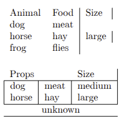

---
## Front matter
lang: ru-RU
title: Лабораторная работа №5
subtitle: Таблицы в latex
author:
  - Кубасов В.Ю., ст.б. 1132249516
date: 3 ноября 2025

## i18n babel
babel-lang: russian
babel-otherlangs: english

## Formatting pdf
toc: false
toc-title: Содержание
slide_level: 2
aspectratio: 169
section-titles: true
theme: metropolis
header-includes:
 - \metroset{progressbar=frametitle,sectionpage=progressbar,numbering=fraction}

## Fonts
mainfont: IBM Plex Serif
romanfont: IBM Plex Serif
sansfont: IBM Plex Sans
monofont: IBM Plex Mono
mathfont: STIX Two Math
mainfontoptions: Ligatures=Common,Ligatures=TeX,Scale=0.94
romanfontoptions: Ligatures=Common,Ligatures=TeX,Scale=0.94
sansfontoptions: Ligatures=Common,Ligatures=TeX,Scale=MatchLowercase,Scale=0.94
monofontoptions: Scale=MatchLowercase,Scale=0.94,FakeStretch=0.9
mathfontoptions:
---

# Вводная часть

## Цели и задачи

### Цель работы:

- Научиться работать с таблицами в latex, как с основным инструментом структурирования данных

### Задачаи работы:

- Используйте пример простой таблицы, чтобы начать экспериментировать с таблицами.
- Попробуйте разные варианты выравнивания, используя столбцы типа l, c и r.
- Что произойдёт, если в строке таблицы слишком мало элементов?
- А если их слишком много?
- Поэкспериментируйте с командой \\multicolumn, чтобы охватить несколько столбцов.

# Теоретическое введение

Таблицы нужны в отчете для структурирования и наглядного представления больших объемов данных, которые сложно описать текстом. Они позволяют быстро анализировать, сравнивать и находить закономерности в информации, а также улучшают читаемость документа. 

# Реализация

## Выравнивание

- l - выравнивание по левому краю ячейки
- r - выравнивание по правому краю ячейки
- c - выравнивание по центру ячейки

## Разное количество элементов

При недостатке ячеек в строке, рендер переходит на следующую строку

## Разное количество элементов

Не компилируется 

## Multicolumn

# Выводы

- Научились структурировать и организовывать информацию
- Научились структурировать и организовывать информацию с помощью таблиц
- Познакомились с табличным видом организации информации в latex

