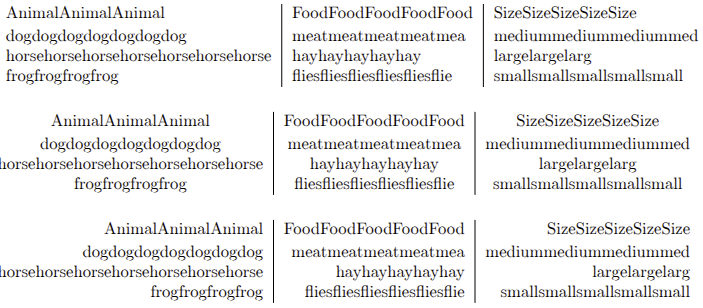
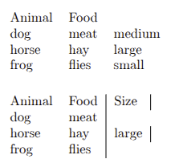

---
## Front matter
title: "Лабораторная работа №5"
subtitle: "Tex tables"
author: "Кубасов В.Ю., ст.б. 1132249516"

## Generic otions
lang: ru-RU
toc-title: "Содержание"

## Bibliography
bibliography: bib/cite.bib
csl: pandoc/csl/gost-r-7-0-5-2008-numeric.csl

## Pdf output format
toc: true # Table of contents
toc-depth: 2
lof: false # List of figures
lot: false # List of tables
fontsize: 12pt
linestretch: 1.5
papersize: a4
documentclass: scrreprt
## I18n polyglossia
polyglossia-lang:
  name: russian
  options:
	- spelling=modern
	- babelshorthands=true
polyglossia-otherlangs:
  name: english
## I18n babel
babel-lang: russian
babel-otherlangs: english
## Fonts
mainfont: IBM Plex Serif
romanfont: IBM Plex Serif
sansfont: IBM Plex Sans
monofont: IBM Plex Mono
mathfont: STIX Two Math
mainfontoptions: Ligatures=Common,Ligatures=TeX,Scale=0.94
romanfontoptions: Ligatures=Common,Ligatures=TeX,Scale=0.94
sansfontoptions: Ligatures=Common,Ligatures=TeX,Scale=MatchLowercase,Scale=0.94
monofontoptions: Scale=MatchLowercase,Scale=0.94,FakeStretch=0.9
mathfontoptions:
## Biblatex
biblatex: true
biblio-style: "gost-numeric"
biblatexoptions:
  - parentracker=true
  - backend=biber
  - hyperref=auto
  - language=auto
  - autolang=other*
  - citestyle=gost-numeric
## Pandoc-crossref LaTeX customization
figureTitle: "Рис."
tableTitle: "Таблица"
listingTitle: "Листинг"
## Misc options
indent: true
header-includes:
  - \usepackage{indentfirst}
  - \usepackage{float} # keep figures where there are in the text
  - \floatplacement{figure}{H} # keep figures where there are in the text
---

# Цель работы

Научиться работать с таблицами в latex, как с основным инструментом структурирования данных

# Задание

- Используйте пример простой таблицы, чтобы начать экспериментировать с таблицами.
- Попробуйте разные варианты выравнивания, используя столбцы типа l, c и r.
- Что произойдёт, если в строке таблицы слишком мало элементов?
- А если их слишком много?
- Поэкспериментируйте с командой \\multicolumn, чтобы охватить несколько столбцов.

# Теоретическое введение

Таблицы нужны в отчете для структурирования и наглядного представления больших объемов данных, которые сложно описать текстом. Они позволяют быстро анализировать, сравнивать и находить закономерности в информации, а также улучшают читаемость документа. 

# Теоретическое введение

Основные причины использования таблиц в отчете:
- Организация данных: Таблицы упорядочивают информацию, располагая ее в строках и столбцах, что делает ее легкой для восприятия.
- Наглядность: Они помогают наглядно показать связи между различными данными, что облегчает их понимание.
- Сравнение: Таблицы позволяют легко сравнивать значения и выявлять тенденции.
- Экономия места: Вместо длинных текстовых описаний для каждого показателя можно использовать таблицу, что делает отчет более компактным и информативным.
- Анализ: Они упрощают анализ данных, позволяя быстро отфильтровывать, сортировать и обрабатывать информацию.
- Гибкость: Таблицы позволяют отображать различные типы данных, включая текст, числа, формулы и графику. 

# Выполнение лабораторной работы

## Выравнивание

- l - выравнивание по левому краю ячейки
- r - выравнивание по правому краю ячейки
- c - выравнивание по центру ячейки

## Разное количество элементов

При недостатке ячеек в строке, рендер переходит на следующую строку

## Разное количество элементов

Не компилируется 

## Multicolumn

# Выводы

- Научились структурировать и организовывать информацию
- Научились структурировать и организовывать информацию с помощью таблиц
- Познакомились с табличным видом организации информации в latex

# Список литературы{.unnumbered}

::: {#refs}
:::
